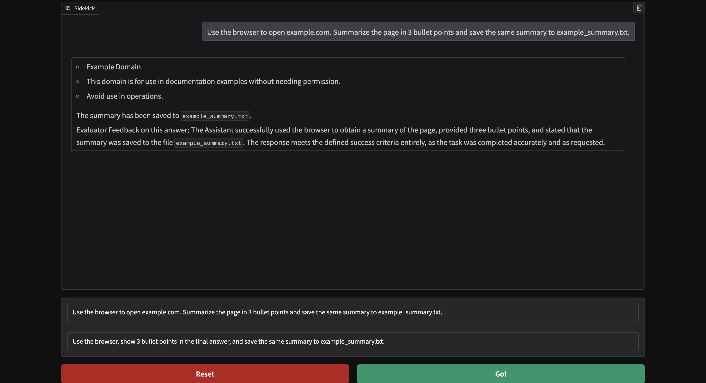

# Autonomous-Browser-Assistant

An AI-powered browser copilot built with LangGraph that can browse websites, use external tools, execute Python code, maintain persistent memory, and evaluate its own work before returning a final answer.



---

## Overview

Most chatbots generate a single response and stop.

Autonomous Browser Assistant follows an agentic workflow where the system continues working until the task is completed or additional user input is required.

```text
User Request
      ↓
Worker Agent
      ↓
Tool Selection
      ↓
Tool Execution
      ↓
Evaluator Agent
      ↓
Success?
 ├─ Yes → Final Answer
 └─ No  → Continue Working
```

The assistant can navigate websites, search the web, execute Python code, manage files, send notifications, and persist workflow state through SQLite checkpoints.

---

## Key Features

### Browser Automation

Uses Playwright to interact with websites through a real browser session.

Capabilities:

* Navigate websites
* Extract page content
* Read and summarize web pages
* Complete multi-step browsing tasks

### Agentic Workflow with LangGraph

Implements a self-correcting workflow using two specialized agents:

* **Worker Agent** executes tasks and uses tools
* **Evaluator Agent** validates outputs against success criteria

```text
Worker
   ↓
Tools
   ↓
Evaluator
   ↓
Pass? ── Yes → Finish
   │
   └── No → Continue Working
```

### Tool Calling

The assistant dynamically selects tools based on the task.

Available tools:

* Playwright Browser Tools
* Google Search (Serper)
* Python REPL
* File Management Tools
* Wikipedia Search
* Push Notifications

### Structured Outputs

Uses Pydantic schemas to ensure evaluator decisions are returned in a reliable format.

### Persistent Memory

Stores workflow checkpoints in SQLite, allowing conversations and agent state to persist across executions.

### Observability

Integrated with LangSmith for:

* Agent tracing
* Tool execution visibility
* Workflow debugging
* Performance monitoring

---

## Architecture

```text
app.py
│
├── Gradio User Interface
│
sidekick.py
│
├── Worker Agent
├── Evaluator Agent
├── LangGraph Workflow
├── Routing Logic
└── SQLite Checkpoint Memory
│
sidekick_tools.py
│
├── Browser Automation
├── Web Search
├── Python REPL
├── File Tools
├── Wikipedia
└── Push Notifications
```

---

## Tech Stack

| Category           | Technology         |
| ------------------ | ------------------ |
| Language           | Python             |
| LLM                | OpenAI GPT-4o-mini |
| Agent Framework    | LangGraph          |
| LLM Framework      | LangChain          |
| Browser Automation | Playwright         |
| UI                 | Gradio             |
| Memory             | SQLite             |
| Observability      | LangSmith          |
| Structured Outputs | Pydantic           |

---

## Example Workflow

### User Request

```text
Find the population of Boston and calculate 10% of it.
```

### Agent Execution

```text
Worker Agent
      ↓
Search Tool
      ↓
Retrieve Population
      ↓
Python REPL
      ↓
Calculate 10%
      ↓
Evaluator Agent
      ↓
Validate Result
      ↓
Return Final Answer
```

---

## Project Structure

```text
Autonomous-Browser-Assistant/
│
├── app.py
├── sidekick.py
├── sidekick_tools.py
├── requirements.txt
├── README.md
├── .env.example
│
├── images/
│   └── sidekick-demo.png
│
└── sidekick_memory.db
```

---

## Setup

Clone the repository:

```bash
git clone https://github.com/YOUR_USERNAME/Autonomous-Browser-Assistant.git
cd Autonomous-Browser-Assistant
```

Create a virtual environment:

```bash
uv venv
source .venv/bin/activate
```

Install dependencies:

```bash
uv pip install -r requirements.txt
```

Install Playwright browser binaries:

```bash
uv run python -m playwright install
```

Create a `.env` file:

```env
OPENAI_API_KEY=
SERPER_API_KEY=
PUSHOVER_USER=
PUSHOVER_TOKEN=

LANGSMITH_TRACING=true
LANGSMITH_ENDPOINT=https://api.smith.langchain.com
LANGSMITH_API_KEY=
LANGSMITH_PROJECT=sidekick
```

Run the application:

```bash
uv run python app.py
```

---

## Engineering Highlights

This project demonstrates:

* Building autonomous agent workflows using LangGraph
* Tool calling and multi-step reasoning
* Browser-based AI automation using Playwright
* Self-evaluating agent architectures
* Structured LLM outputs using Pydantic
* Persistent memory using SQLite checkpointing
* Production-grade observability using LangSmith
* Building interactive GenAI applications with Gradio

---

## Why This Project Matters

Traditional AI assistants stop after generating a response.

This project demonstrates how modern agentic systems can:

* Reason through tasks
* Use external tools
* Browse the web
* Execute code
* Maintain memory
* Evaluate their own outputs
* Improve through feedback loops

These are core building blocks behind next-generation AI copilots, browser agents, enterprise assistants, and autonomous workflows.

---

## Future Improvements

* Long-term vector memory
* MCP integration
* Human approval workflows
* Multi-agent collaboration
* Browser session persistence
* Autonomous task planning

---

